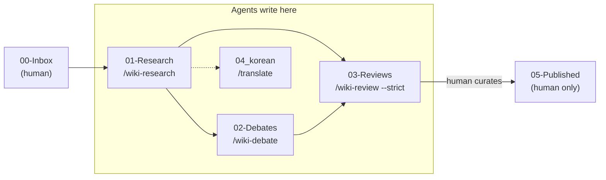

# Obsidian Multi-Agent Vault

[](LICENSE)
[](https://obsidian.md)


[](https://github.com/bomsan69/obsidian-multi-agent-vault/stargazers)

A local **Obsidian knowledge vault** where **Claude, Codex, and GLM** research, debate,
and review notes — then a human curates what gets published. No orchestration plugin, no
lock-in: just plain `.md` files, the Obsidian Local REST API, and four slash commands.

> **Why:** No single LLM admits its own blind spots. Put the same problem to several models,
> **record what each one says**, and **verify before you trust it** — the value comes from the
> `[VERIFY]`/`[FIX]` items a review surfaces, not from a "consensus" number.

---

## What's inside

| Component | Role |
|---|---|
| **Obsidian Vault** (`.md` files) | Persistent memory — semantic knowledge that survives across sessions |
| **`/wiki-*` commands** → Codex CLI + GLM via OpenRouter (direct) | Multi-model orchestration, **plugin-free** |
| **`/wiki-review --strict`** | Verification — flags unconfirmable claims as `[VERIFY]` |
| **`CLAUDE.md`** | The contract every agent obeys (write zones, output format, session rules) |

### The four commands (`.claude/commands/`)

- **`/wiki-research <topic>`** — parallel research across models → `01-Research/`
- **`/wiki-debate <topic>`** — structured positions + rebuttals → `02-Debates/`
- **`/wiki-review <path> [--strict]`** — Claude+Codex review → `03-Reviews/`, writes `review_score` back
- **`/translate <path>`** — English → natural Korean, terms preserved → `04_korean/`

### Vault zones

```text
00-Inbox/     Human only — raw captures
01-Research/  Agents — /wiki-research output
02-Debates/   Agents — /wiki-debate output
03-Reviews/   Agents — /wiki-review output
04_korean/    Agents — /translate output
05-Published/ Human only — curated, final notes
```

**Golden rule:** agents write to `01`–`03` and `04_korean`; only a human moves notes to
`05-Published/`. That separation is what prevents unverified content from being "published".

---

## Repository structure

```text
obsidian-multi-agent-vault/
├── CLAUDE.md                     # Agent contract — every session reads this first
├── README.md                     # You are here
├── GUIDE.md                      # Full setup walkthrough (REST API, providers, commands)
├── blog-verified-second-brain.md # Background & design rationale
├── LICENSE                       # MIT
├── .env.example                  # Copy → .env, add your API keys (.env is git-ignored)
├── .gitignore
│
├── .claude/
│   └── commands/                 # The four slash commands
│       ├── wiki-research.md       # /wiki-research → 01-Research/
│       ├── wiki-debate.md         # /wiki-debate   → 02-Debates/
│       ├── wiki-review.md         # /wiki-review   → 03-Reviews/
│       └── translate.md           # /translate     → 04_korean/
│
├── 00-Inbox/                     # Human only — raw captures
├── 01-Research/                  # Agents — research notes
│   ├── lora-vs-qlora-fine-tuning-tradeoffs.md
│   └── project-rationale.md
├── 02-Debates/                   # Agents — debate transcripts
├── 03-Reviews/                   # Agents — review notes (writes review_score back to source)
│   └── lora-vs-qlora-fine-tuning-tradeoffs-review.md
├── 04_korean/                    # Agents — Korean translations
│   └── lora-vs-qlora-fine-tuning-tradeoffs.md
├── 05-Published/                 # Human only — curated, final notes
│
└── .obsidian/                    # Obsidian config (workspace & plugin secrets are git-ignored)
```

**Workflow** — agents fan out into the write zones; only a human publishes:



---

## Requirements

- [Obsidian](https://obsidian.md) + the **Local REST API** plugin (coddingtonbear, **v4.x**)
- [Claude Code](https://claude.com/claude-code) (`npm install -g @anthropic-ai/claude-code`)
- *(optional, for extra perspectives)* [Codex CLI](https://github.com/openai/codex) and an
  [OpenRouter](https://openrouter.ai) API key (used for the GLM provider slot — no CLI needed)

> The Local REST API plugin now **requires an API key (Bearer token)** on every `/vault/**`
> request — the old "no auth" behavior is gone. See [`GUIDE.md`](GUIDE.md) §3.

## Quick start

```bash
git clone https://github.com/bomsan69/obsidian-multi-agent-vault.git
cd obsidian-multi-agent-vault

# 1) Open the folder as a vault in Obsidian, enable the Local REST API plugin, copy its API Key.
# 2) Configure secrets (never committed):
cp .env.example .env       # then paste OBSIDIAN_API_KEY (and OPENROUTER_API_KEY if using GLM)

# 3) Start Claude Code inside the vault:
claude
/wiki-research "your topic here"
```

Full walkthrough (REST API auth, provider setup, structure, commands): **[`GUIDE.md`](GUIDE.md)**.
Background & design rationale: **[`blog-verified-second-brain.md`](blog-verified-second-brain.md)**.

---

## Example notes

Real research/debate/review threads generated in this vault, showing how the pieces link together:

**LoRA vs QLoRA fine-tuning**
- [Research](01-Research/lora-vs-qlora-fine-tuning-tradeoffs.md) · [Review](03-Reviews/lora-vs-qlora-fine-tuning-tradeoffs-review.md) · [Korean translation](04_korean/lora-vs-qlora-fine-tuning-tradeoffs.md)

**RAG for small corpora (prompt-stuffing vs vector store)**
- [Research](01-Research/rag-prompt-stuffing-vs-vector-store-small-corpus.md) · [Review](03-Reviews/rag-prompt-stuffing-vs-vector-store-small-corpus-review.md)
- [Debate: crossover criterion — query volume vs governance gate](02-Debates/rag-crossover-criterion-query-volume-vs-governance.md) · [Review](03-Reviews/rag-crossover-criterion-query-volume-vs-governance-review.md)
- [Applied case: restaurant CS chatbot architecture](02-Debates/restaurant-cs-chatbot-rag-architecture.md)
- [Follow-up research: grounding verification via structured output](01-Research/grounding-verification-structured-output.md) — first note using GLM (OpenRouter) in place of Gemini

**Local coding models on Intel CPU + AMD GPU Macs**
- [Research: small open-weight coding models](01-Research/small-open-weight-coding-models-intel-mac-amd-gpu.md)
- [Debate: qwen2.5-coder:7b vs deepseek-coder:6.7b](02-Debates/qwen-vs-deepseek-coder-radeon-5500m-ollama.md) · [Review](03-Reviews/qwen-vs-deepseek-coder-radeon-5500m-ollama-review.md)

---

## Honest notes

- **`consensus_score` is a Claude estimate**, not an independent gate — it measures *perspective
  convergence*, not correctness. `/wiki-review --strict` is the real fact-check.
- **No plugin dependency.** Orchestration is done by calling the Codex CLI and the GLM provider
  (via OpenRouter's REST API) directly, so there's nothing to break when a marketplace or
  plugin changes.
- **Why GLM instead of Gemini.** Gemini CLI's free OAuth tier can be blocked with no CLI-side
  fix (`IneligibleTierError`). OpenRouter sidesteps this entirely — one API key, one REST
  endpoint, no CLI, no OAuth to break.
- **Secrets stay local.** `.env` and the Obsidian plugin's `data.json` (which holds the API key)
  are `.gitignore`d. Don't commit them.

## License

[MIT](LICENSE) © 2026 bomsan69

*Original inspiration: "Your Vault as a Shared Brain" by Roan Brasil Monteiro. This
implementation was rebuilt from scratch (the article's repo was gone) and is plugin-free.*
